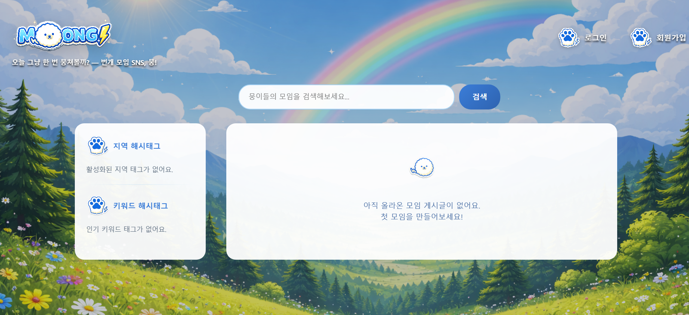

# Moong - 번개모임 SNS (개인 배포 버전)

사용자가 즉시 모임을 생성하고 참여할 수 있는 번개 만남 중심 SNS 플랫폼.  
5인 팀이 함께 개발한 프로젝트를 개인적으로 AWS EC2에 배포한 버전입니다.

[원본 레포](https://github.com/battlegroundcallofduty/Moong_pro) | [라이브 데모](https://moong.site)



---

## 배포 환경

| 항목 | 내용 |
|------|------|
| 서버 | AWS EC2 (Ubuntu, 프리티어) |
| 웹 서버 | Nginx |
| WAS | Gunicorn |
| 프레임워크 | Django 6.0.1 |
| DB | SQLite |
| 정적 파일 | WhiteNoise |

요청 흐름: 클라이언트 → Nginx → Gunicorn → Django

---

## 주요 기능

| 기능 | 설명 |
|------|------|
| 회원 관리 | 회원가입, 로그인/로그아웃, 프로필 수정 |
| 피드 | 메인 피드 목록, 당일 만료 게시글 자동 필터링 |
| 모임 모집글 | 임시저장 → AI 해시태그 자동 생성 → 게시 단계별 플로우 |
| 해시태그 검색 | 해시태그 클릭/키워드 검색 |
| 모임 참여 관리 | 참여 신청/취소, 모임장 승인/거절, 대기 순번 자동 배정 |
| 댓글 | 작성/삭제, 모임장 공지 댓글 표시 |
| 마이페이지 | 생성/참여/종료 모임 이력 조회 |
| 지도 | Kakao Map API 기반 모임 장소 표시 |
| 스케줄러 | APScheduler로 매일 00:05 만료 게시글 자동 처리 |

---

## 배포를 위해 추가/수정한 것

- `settings.py` — SECRET_KEY, DEBUG, ALLOWED_HOSTS를 환경변수로 분리 (`django-environ`)
- `requirements.txt` — gunicorn, whitenoise, django-environ 추가
- `apps.py` — gunicorn 환경에서도 APScheduler 작동하도록 수정
- `Procfile` — gunicorn 실행 명령 정의
- migrations 파일 git 추적 활성화

---

## 🐛 배포 트러블슈팅

**문제 1. 탄력적 IP 접속 불가**

- nginx가 실행 중임에도 포트 80이 열리지 않아 접속이 안 됨.
- 원인: `/etc/nginx/sites-enabled/` 폴더가 비어있었던 것.    
nginx는 이 폴더 안의 설정 파일만 읽기 때문에 아무 사이트도 서빙하지 않는 상태였음.

```bash
sudo ln -s /etc/nginx/sites-available/moong /etc/nginx/sites-enabled/moong
sudo systemctl restart nginx
```

**문제 2. 502 Bad Gateway**

- 탄력적 IP 접속 시 502 에러 발생.
- 원인: nginx(`www-data` 유저)가 `/home/ubuntu/` 디렉토리에 접근 권한이 없어 gunicorn 소켓에 닿지 못함.

```bash
sudo chmod 755 /home/ubuntu
```

755 권한의 의미:
- `7` (소유자 ubuntu): 읽기+쓰기+실행
- `5` (그룹): 읽기+실행
- `5` (그 외): 읽기+실행

---

## 추후 개선 계획
지역 데이터 CSV 적재 방식을 행정안전부 공공데이터, 카카오 등 API 연동 방식으로 전환 검토    
(행정구역 변경 시 자동 반영되도록)

